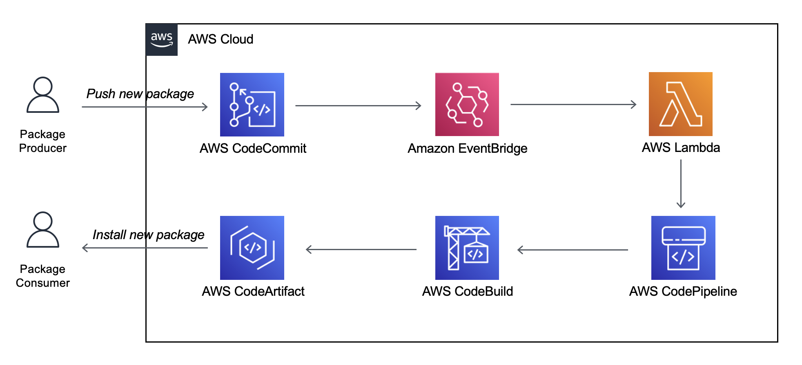

## Publishing Node.js Modules on AWS CodeArtifact using AWS CodePipeline

Code reuse is hard. When writing code for Node.js, developers can take advantage of the Node.js Package Manager (NPM) Command Line Interface (CLI) that enables packaging code into modules which can then reused across projects. These modules or packages can be stored in AWS CodeArtifact and used throughout Node.js applications running on AWS. This pattern provides a continuous integration - continuous deployment pipeline via AWS CodePipeline to lint, test, and publish a new version of a Node.js module into a AWS CodeArtifact Repository. The publish stage of the pipeline uses semantic-release, a fully automated version management and package publishing tool. Semantic release automatically creates a CHANGELOG.md based off your commit messages and updates the version in your package.json via semantic version guidelines. The pipeline and supporting infrastructure is defined via the AWS Cloud Development Kit (CDK).

See the associated Amazon Prescriptive Guidance (APG) Pattern [here](https://docs.aws.amazon.com/prescriptive-guidance/latest/patterns/aws-codepipeline-publish-nodejs-modules) for further information.

## Prerequisites

- AWS Command Line Interface (AWS CLI), installed and configured. For more information, see [Installing, updating, and uninstalling the AWS CLI](https://docs.aws.amazon.com/cli/latest/userguide/cli-chap-install.html).
- Node.js and NPM installed. For more information, see [Node.js Downloads](https://nodejs.org/en/download/).
- AWS Cloud Development Kit (CDK) Toolkit, installed and configured. For more information, see [AWS CDK Toolkit (cdk command)](https://docs.aws.amazon.com/cdk/latest/guide/cli.html).
- An AWS Account bootstrapped with the AWS CDK. For more information, see [Bootstrapping](https://docs.aws.amazon.com/cdk/latest/guide/bootstrapping.html).
- Git, installed and configured. For more information, see [Git](https://git-scm.com/).

## Limitations

- [AWS CodeCommit](https://aws.amazon.com/codecommit/) is the only source control management service compatible with this pattern. GitHub or GitLab cannot be used.
- Node.js packages are the only package format compatible with this pattern. PyPi packages cannot be used.

## Product versions

- AWS CLI Version 2 or greater
- Node.js 14.X or greater
- AWS CDK v2 or greater
- Git 2.X or greater

## Architecture



## Tools

- [Node.js](https://nodejs.org/en/)
- [AWS CDK](https://aws.amazon.com/cdk/)

## Steps

### Setup Domain and Repository

Create the AWS CodeArtifact Domain and Repository which will store packages. Change the variables in the script below and then run the script in your terminal. Make sure you follow the naming constraints for the domain and repository. To be safe, use kebab-case-like-this.
```bash
CA_DOMAIN=my-domain
CA_REPO=my-repo
aws codeartifact create-domain --domain $CA_DOMAIN
aws codeartifact create-repository --domain $CA_DOMAIN --repository $CA_REPO
```

Login to AWS CodeArtifact Repository by running the script below in your terminal. Note, it is a convention to prefix your namepsace with @.
```bash
CA_NAMESPACE=@my-namespace
aws codeartifact login --tool npm --domain $CA_DOMAIN --repository $CA_REPO --namespace $CA_NAMESPACE
```
This updates your ~/.npmrc telling NPM to look for packages with a namespace (prefix) of `$CA_NAMESPACE` within the AWS CodeArtifact Repository `$CA_REPO`.

### Publish the CDK Construct Pipeline

Clone the repository from https://github.com/aws-samples/aws-codepipeline-publish-nodejs-modules and install dependencies.
```bash
git clone https://github.com/aws-samples/aws-codepipeline-publish-nodejs-modules.git
cd aws-codepipeline-publish-nodejs-modules
npm install
```

Deploy the AWS infrastructure required for the pipeline
```bash
cdk deploy
```

Push the code to CodeCommit. Note, the pipeline ran upon deploying in the previous step and failed because the repository wasn't initialized. Pushing code to the repository will cause the pipeline to run.
```bash
git add package-lock.json
git commit -m "feat: initial commit"
git remote set-url origin https://git-codecommit.us-east-1.amazonaws.com/v1/repos/nodejs-pkg-pipeline
git push origin --set-upstream main
```

### Create Node.js Module to Publish

Initialize the CDK Construct with the CDK Toolkit in a new directory
```bash
cd ..
mkdir my-bucket
cd my-bucket
cdk init --language typescript
```

Delete the folders: bin, lib, and test and the file: .npmignore. Add the following file to build your bucket. This example is trivial but you can add more features later on.
```ts
// lib/my-bucket.ts
import { Bucket, BucketProps } from "aws-cdk-lib/aws-s3";
import { Construct } from 'constructs';

interface MyBucketProps extends BucketProps {}

export class MyBucket extends Construct {
  constructor(scope: Construct, id: string, props?: MyBucketProps) {
    super(scope, id);
    new Bucket(this, "MyBucket", props);
  }
}
```

First, install the module you created earlier with the command `npm install @my-namespace/nodejs-pkg-pipeline` which will install the module from CodeArtifact into your node_modules folder. If you get a 404 error, make sure the pipeline created in the previous epic has completed. Second, add the following file:
```ts
// bin/pkg-pipeline.ts
import { App, Stack } from "aws-cdk-lib";
import { Construct } from "constructs";
import { PkgPipeline } from "@my-namespace/nodejs-pkg-pipeline";

const app = new App();
const name = "my-bucket";
class PipelineStack extends Stack {
  constructor(scope: Construct, id: string) {
    super(scope, id);
    new PkgPipeline(this, "MyBucketPipeline", {
      name: id,
      repoDescription: "My Bucket",
      codeArtifactNamespace: "@my-namespace",
      codeArtifactRepo: "my-repo",
      codeArtifactDomain: "my-domain",
    });
  }
}

new PipelineStack(app, name);
```
_Make sure you change "@my-namespace", "my-repo", and "my-domain" in the above code snippet to your values._

Third, update the app key of the cdk.json file so the CDK knows which stack to deploy.
```json
// cdk.json
{
  "app": "npx ts-node --prefer-ts-exts bin/pkg-pipeline.ts",
  ...
}
```

Update the package.json to include the following:
```json
{
  "name": "@my-namespace/my-bucket",
  "version": "0.1.0",
  "files": ["dist/**/*", "lib/**/*"],
  "main": "dist/my-bucket.js",
  "types": "dist/my-bucket.d.ts",
  "scripts": {
    "build": "tsc",
    "watch": "tsc -w",
    "test": "echo \"TODO\"",
    "cdk": "cdk",
    "lint": "echo \"TODO\""
  },
  ...
```

Update the tsconfig.json to include the following:
```json
{
  "compilerOptions": {
    ...
    "declarationMap": true,
    "outDir": "dist",
  },
  "include": ["lib"],
}
```

Also add `dist` to your .gitignore.

Finally, add a .releaserc.js which will tell semantic-release how to release your package
```js
// .releaserc.js
module.exports = {
  branches: ["main"],
  plugins: [
    "@semantic-release/commit-analyzer", // analyzes commits with conventional-changelog standrd
    "@semantic-release/release-notes-generator", // generates changelog content based on conventional-changelog standard
    "@semantic-release/changelog", // updates CHANGELOG.md
    "@semantic-release/npm", // updates version in package.json based on commits
    "@semantic-release/git"
  ],
};
```
IMPORTANT: Since the default .gitignore ignores all .js files, you'll need to add !.releaserc.js to your .gitignore so it's pushed up to your repository.

### Publish my-bucket

Deploy my-bucket pipeline with the CDK:
```bash
cdk deploy
```

Push the code to CodeCommit.
```bash
git add -A
git commit -m "feat: initial commit"
git remote add origin https://git-codecommit.us-east-1.amazonaws.com/v1/repos/my-bucket
git push origin --set-upstream main
```

Congratulations! You've created a Node.js package within CodeArtifact. Go to CodeArtifact in your console to view the package.

### Update my-bucket

After a couple minutes when the pipeline completes for the first time, run git pull and look at the CHANGELOG.md and the version of your package.json to see the automatic updates.

Add default encryption to your bucket managed by S3.
```ts
// lib/my-bucket.ts
import { Bucket, BucketProps, BucketEncryption } from "aws-cdk-lib/aws-s3";
import { Construct } from 'constructs';

interface MyBucketProps extends BucketProps {}
export class MyBucket extends Construct {
  constructor(scope: Construct, id: string, props?: MyBucketProps) {
    super(scope, id);
    const defaultProps = { encryption: BucketEncryption.S3_MANAGED };
    const newProps = props ? { ...defaultProps, ...props } : defaultProps;
    new Bucket(this, "MyBucket", newProps);
  }
}
```

Commit your changes with a commit message that follows [Conventional Commits](https://www.conventionalcommits.org/en/v1.0.0/). Using a commit message prefix of "feat" will create a feature release of your package incrementing Y in the version X.Y.Z. Note, if you needed to make a fix to your bucket you could prefix your commit message with "fix" which will create a patch release of your package incrementing Z in the version X.Y.Z.

```bash
git add lib/my-bucket.ts
git commit -m "feat: add default encryption on bucket"
git push
```

After a couple minutes when the pipeline completes, run `git pull` and look at the CHANGELOG.md and the version of your package.json to see the automatic updates.

You can now install my-bucket into another Node.js project with peace of mind that your bucket has default encryption. Install my-bucket by running `npm install @my-namespace/my-bucket`.  Note, if you try to install the module more than 12 hours after you logged into AWS CodeArtifact initially, you'll need to login again with: `aws codeartifact login --tool npm --domain $CA_DOMAIN --repository $CA_REPO --namespace $CA_NAMESPACE`

## Related Resources

- [Semantic Release](https://semantic-release.gitbook.io/semantic-release/)
- [Conventional Commits](https://www.conventionalcommits.org/en/v1.0.0/)

## Additional Information

Package Workflow: Produce to Consume

1. Package producer pushes code and updates default branch of AWS CodeCommit repository.
1. Amazon EventBridge event is triggered and sent to AWS Lambda function.
1. AWS Lambda function triggers AWS CodePipeline to begin execution except for code updates with a commit message include "[skip ci]". Skipping pipeline executions with this message is important. because otherwise the pipeline would be triggered multiple times as semantic-release creates a new commit message on your default branch each time a new version is released.
1. AWS CodePipeline begins the "Source" stage which downloads the code from AWS CodeCommit.
1. AWS CodePipeline begins the "Lint" stage which runs the command npm run lint within AWS CodeBuild. This typically runs a static code analysis tool like ESLint ensuring high code quality.
1. AWS CodePipeline begins the "Test" stage which runs the command npm run test within AWS CodeBuild. This typically starts a test runner like Jest to run unit tests.
1. AWS CodePipeline begins the "Publish" stage which runs the command npx semantic-release within AWS CodeBuild. This kicks off a package release workflow that determines the next version number, generates release notes, and publishes the package to AWS CodeArtifact. See semantic-release for more information.
1. Package consumer installs the updated package version into their Node.js project with npm install @my-namespace/my-package.

Additional Security Considerations:
- Use AWS CodeCommit with interface VPC endpoints for network level access control. More information [here](https://docs.aws.amazon.com/codecommit/latest/userguide/codecommit-and-interface-VPC.html).
- Use AWS CodeArtifact with interface VPC endpoints for network level access control. More information [here](https://docs.aws.amazon.com/codeartifact/latest/ug/vpc-endpoints.html).
- Connect to CodeCommit using [git-remote-codecommit](https://docs.aws.amazon.com/codecommit/latest/userguide/setting-up-git-remote-codecommit.html)

## Security

See [CONTRIBUTING](CONTRIBUTING.md#security-issue-notifications) for more information.

## License

This library is licensed under the MIT-0 License. See the LICENSE file.

